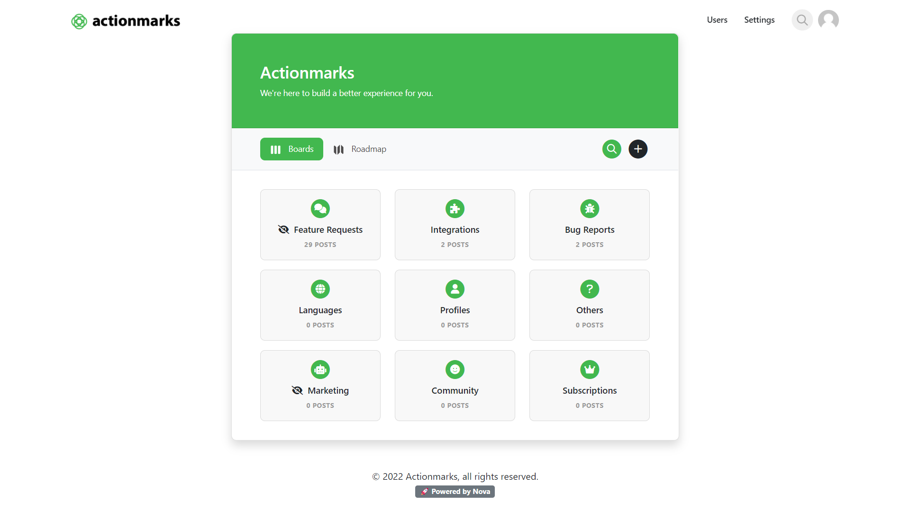

<p align="center">
    
</p>

<h3 align="center">🪐 Nova</h3>

<p align="center">
Sleek, modern, and open-source feedback collection platform for website and product owners.</p>



## Features
- Fast and flexible custom JSON API
- AJAX-powered for a refresh-free experience
- Powerful privacy controls
- Built-in administration & moderation tools
- Developed using PHP 8.0
- Self-hosting ready

## Getting Started
Nova has one of the simplest and straight-forward installations yet. In four steps, you'll have Nova up and running on your server.

###Requirements:

- PHP 8.0+
- Apache 2.2+
- MySQL 5.7+

<strong>Note: For demonstration purposes, Nova includes demo data straight out of the box with the included SQL import file. You may wish to make your own edits to the SQL file before importing.</strong>


### Installation Steps:
1. Download the latest release
2. Import ````datatabase.sql```` into your database
3. Rename ````includes/config.example.php```` to ````includes/config.php````
4. Enter site URL & database details into ````includes/config.php````
5. You're done! 🎉

###Using custom prefixes

Although the Nova database and its tables will work right out of the box after importing, as an extra security measure, Nova includes custom prefix support, specified within the config file. The default prefix is set to ```nova_```, but can be changing by updating the ``DB_PREFIX`` constant within ````includes/config.php```` and doing a find and replace in ````database.sql```` before importing.

#### Why would I want to do this?
With most instances of Nova using the prefix of ```nova_```, it may be easier for attackers to find and wreak havoc on your database, if they are aware of this default prefix. Setting a custom prefix makes it more difficult to locate and identify Nova tables in your database.


## Copyright
&copy; 2022 Austin Dudzik, All Rights Reserved. Code released under the [MIT License](https://github.com/austin-dudzik/nova/blob/master/LICENSE).